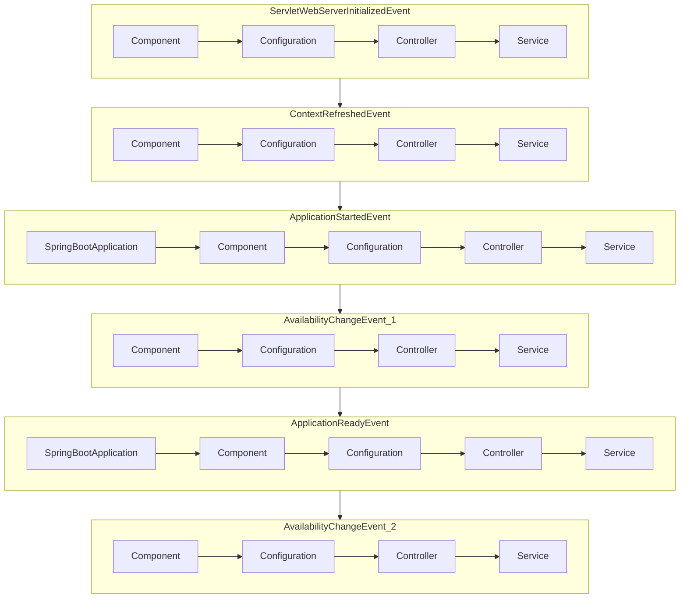

```mermaid
flowchart TD
    subgraph ServletWebServerInitializedEvent
        Component1[Component] --> Configuration1[Configuration] --> Controller1[Controller] --> Service1[Service]
    end

    subgraph ContextRefreshedEvent
        Component2[Component] --> Configuration2[Configuration] --> Controller2[Controller] --> Service2[Service]
    end

    subgraph ApplicationStartedEvent
        SpringBootApplication3[SpringBootApplication] --> Component3[Component] --> Configuration3[Configuration] --> Controller3[Controller] --> Service3[Service]
    end
    
    subgraph AvailabilityChangeEvent_1
        Component4[Component] --> Configuration4[Configuration] --> Controller4[Controller] --> Service4[Service]
    end

    subgraph ApplicationReadyEvent
        SpringBootApplication5[SpringBootApplication] --> Component5[Component] --> Configuration5[Configuration] --> Controller5[Controller] --> Service5[Service]
    end

    subgraph AvailabilityChangeEvent_2
        Component6[Component] --> Configuration6[Configuration] --> Controller6[Controller] --> Service6[Service]
    end

    ServletWebServerInitializedEvent --> ContextRefreshedEvent --> ApplicationStartedEvent --> AvailabilityChangeEvent_1 --> ApplicationReadyEvent --> AvailabilityChangeEvent_2
```